# Проект "детская машинка"

Рассчитан на детей в качестве развлекающего и обущающего материала.

Может быть использован в разработке сторонних arduino-подобных проектах.

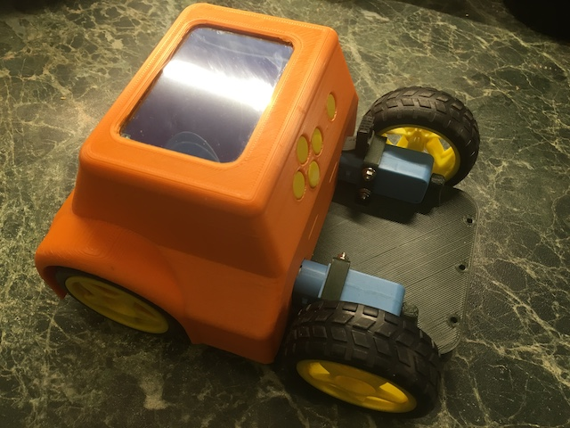
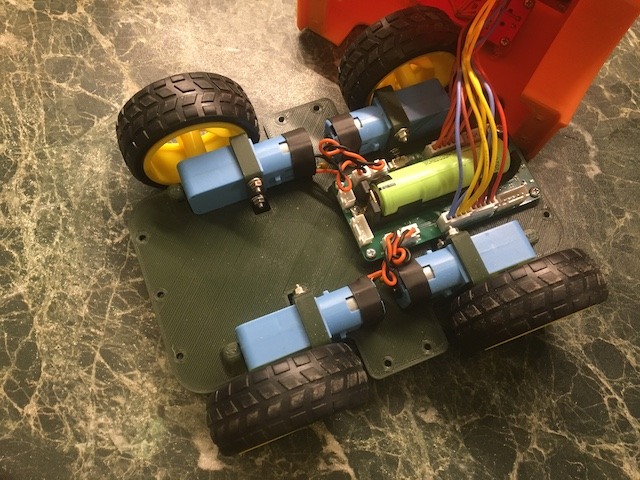

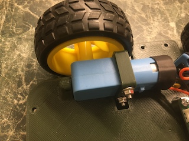 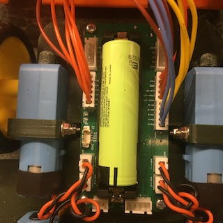


- [видео 1](https://disk.yandex.ru/d/IK6FT8vPRshmdA/IMG_3110.MOV)
- [видео 2](https://disk.yandex.ru/d/IK6FT8vPRshmdA/IMG_3111.MOV)

## Инструкция пользователя

Машинка катается в двух режимах:

1. Прямолинейный.

    Запускается одной из четырёх кнопок курсора:

    - вперёд,
    - назад,
    - вращение влево,
    - вращение вправо.

    Машинка будет двигаться 40 секунд и потом отключится.

    Вручную остановить её можно кнопкой "стоп", расположенной отдельно справа.

2. Программируемый.

    Нажимая непрерывно на экран пальцем или стилусом, двигаем палец
    про планируемому маршруту.

    Маршрут указан промежуточными точками. Чем быстрее двигаем пальцем-стилусом,
    тем длиннее будут прямолинейные участки.

    После отпускания пальца/стилуса от экрана, запустится таймер, по истечении
    которого машинка начнёт движение по маршруту.

    Машинка остановится при достижении конечной точки маршрута.

    Вручную остановить её можно кнопкой "стоп", расположенной отдельно справа.

> При отсутствии движения машинки и нажатия на кнопки управления
> машинка через 40 секунд перейдёт в спящий режим.
>
> Выход из спящего режима происходит при нажатии на любую кнопку управления.

## Компиляция (сборка) прошивки с помощью CubeMX

Необходимые пакеты и программы:

- [STM32CubeMX](https://www.st.com/en/development-tools/stm32cubemx.html)

- [arm-none-eabi-gcc](https://developer.arm.com/downloads/-/gnu-rm)

    Для MacOS используйте:

    ```
    brew install --cask gcc-arm-embedded
    ```

- утилита make

Исходный код находится в директории [cube](cube).

1. Открываем файл [car.stm32f401ret.ioc](cube/car.stm32f401ret.ioc) в CubeMX.

2. Жмём кнопку "Generate Code".

3. Запускаем командную строку (терминал).

4. Переходим в директорию, где лежит файл car.stm32f401ret.ioc, открытый в п.1.

5. Выполняем:

    ```
    make
    ```

6. Если всё скомпилировалось успешно, во вложенной директории build будет лежать файл car.stm32f401ret.bin

[Инструкция по обновлению прошивки](doc/fwburn/README.md)


## Изготовление платы

- [Архив с gerber-файлами](hw/v1.0/car.v.1.0.zip)

- [Схема принципиальная](hw/v1.0/car.v1.0.jpg)

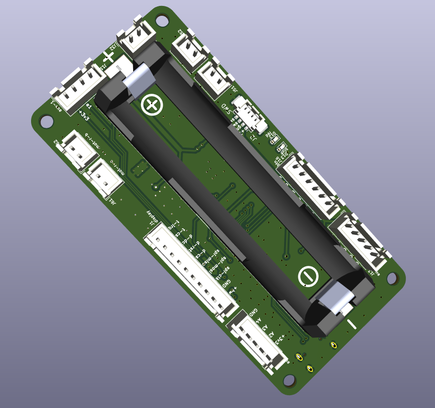 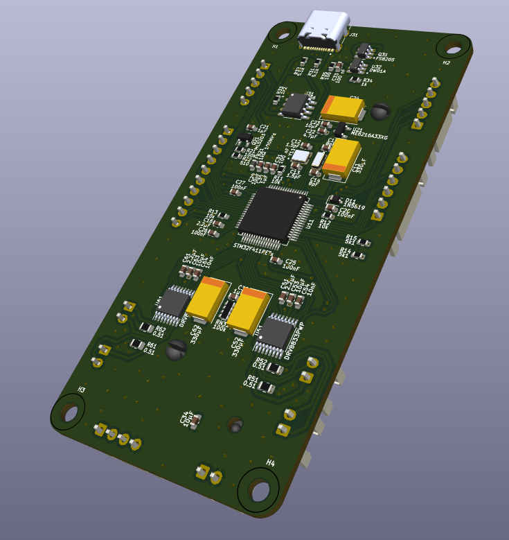


## Изготовление и сборка корпуса

Комплектация:

- [Шасси](model/car-chassis.stl)

    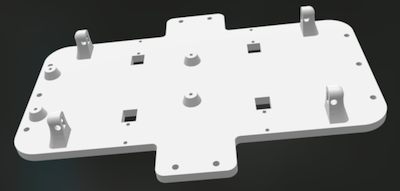

- [Кабина](model/car-cabine.stl)

    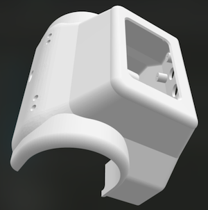

- [Крепления моторов](model/car-motoclip.stl) - 4шт

    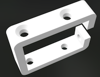

Дополнительно требуется приобрести:

- Комплект "колесо-мотор" для Arduino-машины в количестве 4шт.

    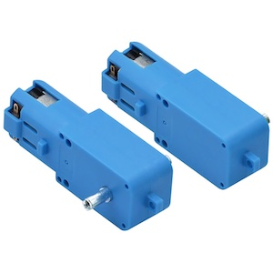 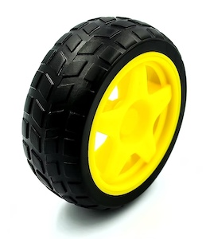

- [Крепёж](model/bolt.md)

## Известные проблемы

- без конденсаторов на двигателях часто подвисает

    - иногда подвисает только дисплей, достаточно остановить и дождаться ухода в сон
    - иногда подвисает напрочь, помогает только общий ребут

    Наличие керамических конденсаторов на двигателях не решает проблему полностью.

- калибровка угла поворота не учитывает разряд аккумулятора

    при более разряженном аккумуляторе поворот на тот же угол требует больше времени
