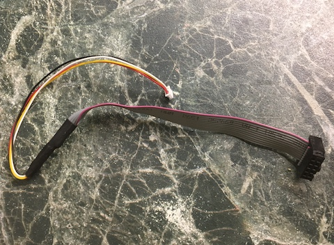
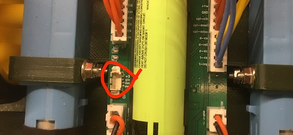
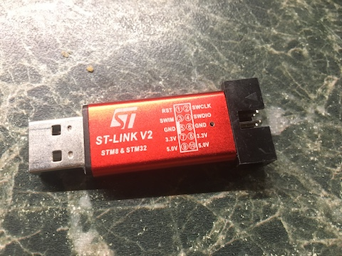

# Обновление прошивки

Неодходимое оборудование:

- SWD-кабель

    

    

- программатор ST-Link v.2

    

- [Утилита взаимодействия по SWD-порту](https://www.st.com/en/development-tools/stm32cubeprog.html)
